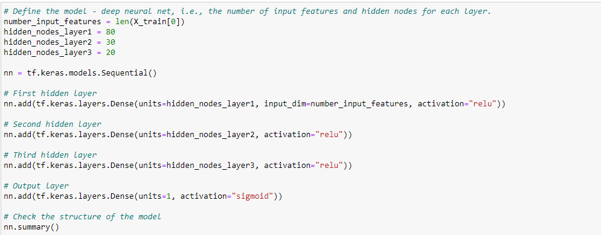
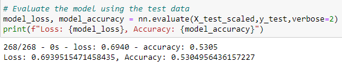
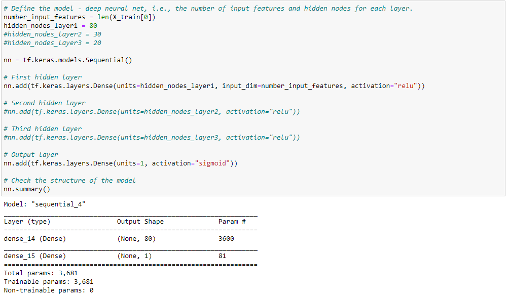
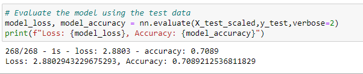

# Neural Network Model

## Overview of the analysis
For this analysis we are going to be using neural networks and machine learning to create a classifier to predict the success of the applicants in a charity. 

We are going to be using a CSV with data from more than 34,000 organizations that received funding by Alphabet Soup.

## Results
- Data Preprocessing
    - What variable(s) are considered the target(s) for your model ?
        - The important thing we wanted to predict is if the applicant is going to be successful or not, so the target variable will be = IS_SUCCESSFUL
    - What variable(s) are considered to be the features for your model?
        - The other columns are features.
    - What variable(s) are neither targets nor features, and should be removed from the input data?
        - As in the beggining, the dropped columns were 'EIN' and 'NAME' so this were neither tagets nor features.

- Compilign, Training and Evaluating the Model
    - How many neurons, layers, and activation functions did you select for your neural network, and why ?
        - I decided to add 3 hidden layers giving them:
        1. 80 neurons
        2. 30 neurons
        3. 20 neurons
        
    - Where you able to achieve the target model performance ?
        - No, i was only able to reach 53% of the target.
        
    - What steps did you take to try and increase model performance ?
        - To try to improve model performance I remove two of the neurons leaving only the first one.
        
        this way the model performance increased to 70%.
        

----------------
## Summary

The model firs had a 53% of accuracy but after the change of removing the two neurons, ir increased significantly to 70% of accuracy. This is close to the 75% of accuracy proposed, maybe we can make othis more aoccurate by changing the data, removing useless columns or maybe increasing the number of data.